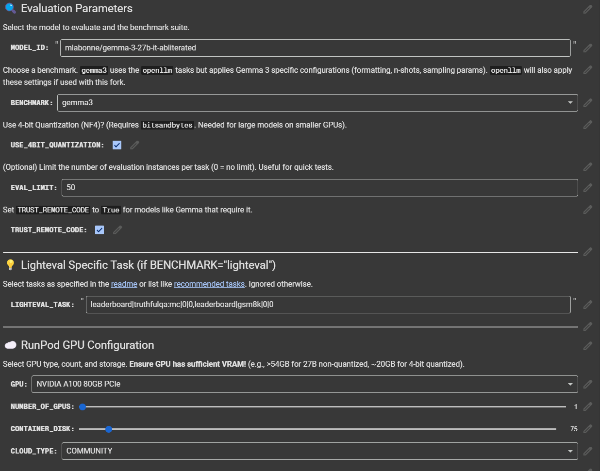

<div align="center">
  <h1>🧐 LLM AutoEval: Gemma3 Edition</h1>
  <p>
    ✨ <a href="https://huggingface.co/mlabonne">Forked from mlabonne</a> • 
    🧠 <a href="https://huggingface.co/google">Supports Gemma 3</a> • 
    🚀 <a href="https://colab.research.google.com/drive/1JNk0_uQqRTyH4OfG867P3HmHj6x2CC9Q?usp=sharing">Colab Notebook</a>
  </p>
  <p><em>Official LLM AutoEval fork, updated for compatibility with Google's Gemma 3 based models.</em></p>
  <a href="https://colab.research.google.com/drive/1JNk0_uQqRTyH4OfG867P3HmHj6x2CC9Q?usp=sharing"></a>
</div>
<br/>

<p align="center">

</p>

## 🔍 Overview

This fork of **LLM AutoEval** is optimized for **evaluating Google's Gemma 3 models** (e.g. `gemma-3-27b-it`) using the exact settings described in the [official technical report](https://ai.google.dev/gemma/docs/gemma-3). It ensures reproducible benchmark results and compatibility with standard evaluation suites.

### Key Enhancements

* Hyperparameter tuning for Gemma 3: `temperature=1.0`, `top_p=0.95`, `top_k=64`
* Benchmarks configured to match Google's evaluation (e.g. `gsm8k` 8-shot, CoT)
* Compatibility updates for new tokenizer, prompts, and padding behavior
* Colab + RunPod-friendly setup
* Option to enable/disable 4bit quantization
* Option to set limits on evaluation for quick results when experimenting

## ⚡ Quick Start

### Evaluation

* **`MODEL_ID`**: Enter the model ID from Hugging Face (e.g. `google/gemma-3-27b-it` or a compatible fork).
* **`BENCHMARK`**:
  * `nous`: AGIEval, GPT4ALL, TruthfulQA, Bigbench (Teknium / Nous-style benchmark sweep)
  * `openllm`: ARC, HellaSwag, MMLU, Winogrande, GSM8K, TruthfulQA (Open LLM Leaderboard set)
  * `lighteval`: Hugging Face's task-level evaluator (e.g. HELM, PIQA, MATH, GSM8K). Use `LIGHTEVAL_TASK` to specify tasks.
* **`LIGHTEVAL_TASK`**: Comma-separated list of task names (see [recommended tasks](https://github.com/huggingface/lighteval/blob/main/examples/tasks/recommended_set.txt))

### Benchmarks Implemented in `runpod.sh`

Each benchmark triggers specific task suites:

- ✅ `nous`:
  - `agieval_*`
  - `hellaswag`, `openbookqa`, `winogrande`, `arc_easy`, `arc_challenge`, `boolq`, `piqa`
  - `truthfulqa_mc`
  - `bigbench_*`

- ✅ `openllm`:
  - `arc_challenge` (25-shot)
  - `hellaswag` (10-shot, Char-Len norm)
  - `mmlu` (5-shot, Char-Len norm)
  - `winogrande` (5-shot, Accuracy)
  - `gsm8k` (**updated to 8-shot + CoT**)
  - `truthfulqa`

- ✅ `lighteval`: Any HF-compatible task with `--use_chat_template` and custom `LIGHTEVAL_TASK`

## ☁️ Cloud GPU Setup

* **`GPU`**: Pick high-VRAM GPUs (e.g. A100 80GB, RTX 6000 Ada) for Gemma 27B
* **`Number of GPUs`**: Multi-GPU supported with `accelerate`
* **`REPO`**: Set to your fork of this repo (the container executes `runpod.sh`)
* **`DEBUG`**: Keep the pod alive for manual inspection

## 🧪 Hyperparameters (for Gemma3)

All generations use:
- `temperature: 1.0`
- `top_p: 0.95`
- `top_k: 64`
- `do_sample: True` (when applicable)
- `generation_config` passed through `gen_kwargs`

GSM8K uses:
- `8-shot`
- `CoT prompting`
- Evaluation via `exact_match`

## 🛠️ Troubleshooting

* "700 Killed": Use larger GPU (e.g. A100)
* "triu_tril_cuda_template": See [issue #22](https://github.com/mlabonne/llm-autoeval/issues/22)
* "File not found": Use `DEBUG=true` and check logs

## 📈 Benchmarks + Leaderboards

You can compare results with:
- [Open LLM Leaderboard](https://huggingface.co/spaces/HuggingFaceH4/open_llm_leaderboard)
- [YALL Leaderboard](https://huggingface.co/spaces/mlabonne/Yet_Another_LLM_Leaderboard)
- Teknium's [LLM-Benchmark-Logs](https://github.com/teknium1/LLM-Benchmark-Logs)

## 🙏 Acknowledgements

This fork is based on `mlabonne/llm-autoeval` and includes contributions from:
- [dmahan93](https://github.com/dmahan93) – AGIEval integration
- [burtenshaw](https://github.com/burtenshaw) – LightEval support
- [Hugging Face](https://huggingface.co) – `lighteval` + `transformers`
- [EleutherAI](https://github.com/EleutherAI/lm-evaluation-harness) – Core harness
- [Teknium](https://github.com/teknium1), [NousResearch](https://github.com/NousResearch) – Benchmarks
- [Google](https://ai.google.dev/gemma) – Gemma 3 LLMs + Eval configs

## 🧪 Colab Notebook

[Open in Colab](https://colab.research.google.com/drive/1Igs3WZuXAIv9X0vwqiE90QlEPys8e8Oa?usp=sharing)

Evaluate your Gemma 3 fork now →

```bash
MODEL_ID=your-model BENCHMARK=openllm bash runpod.sh
```

